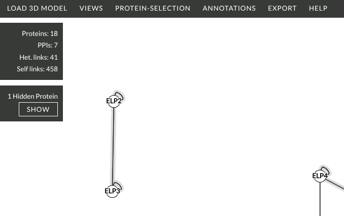

## Protein Selection Menu ##

This dropdown contains tools for controlling which proteins are visible and which are selected.

### Hide / Show ###

- **Hide Selected** — removes the currently selected proteins from all views. They remain in the dataset but are no longer drawn.
- **Hide Unselected** — removes all proteins that are not currently selected from all views.

To make hidden proteins visible again click 'SHOW' under the count of hidden proteins.

### Change Selection ###

- **+Neighbours** — extends the current selection by adding all proteins that are directly crosslinked to any already-selected protein. Useful for iteratively exploring the local neighbourhood of a protein of interest.

### Select by Text Filter ###

A text input that selects proteins whose name or description contains the entered string (case-insensitive). Typing in the box and pressing Enter (or clicking elsewhere) immediately updates the selection. Entering an empty string clears the filter.
