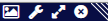

## Views Menu ##

The Views menu contains checkboxes to open and close the various visualisation panels available in xiVIEW. Each panel opens in a floating, resizable window that can be repositioned within the browser.

- **[Legend & Colours](../views/legend.html)** — shows the current colour scheme legend and allows switching between colour schemes for crosslinks and proteins.
- **[Circular](../views/circular.html)** — arranges proteins in a circle with crosslinks drawn as arcs between them.
- **[3D (NGL)](../views/3dngl.html)** — spatial view of protein complexes and crosslinks superimposed on a loaded PDB structure. Requires a PDB file to be loaded first via [Load 3D Model](../load-3d-model.html).
- **[Protein Info](../views/proteinInfo.html)** — shows metadata and crosslink-annotated sequence diagrams for the currently selected proteins.
- **[Spectrum](../views/xispec.html)** — displays the annotated mass spectrum for a match selected via the [Selected Match Table](../views/selection-table.html).

- **[Histogram](../views/histogram.html)** — plots the distribution of a chosen crosslink or match attribute (e.g. score, distance) across the filtered dataset.
- **[Alignment](../views/alignment.html)** — shows per-protein sequence alignments between the search sequences, any loaded PDB chains, and UniProt canonical sequences.
- **mzIdentML Metadata** — displays metadata extracted from the loaded mzIdentML file.

### Panel View Functionality ###
The views shown within the panels have a number of functions available through the icons at the top of the panel frame. From left to right these are:

1. Export an image (useful when the same option in the control panel has been hidden).
2. Show / hide the view's control panel i.e. only show the visualisation.
3. Maximise / restore the panel size.
4. X - close the panel.

The panels can also be resized by dragging their corners and repositioned by dragging their title bars.