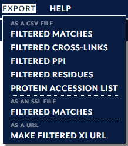

### 3. Viewing Data ###
There are a number of different views available for exploring cross-links within xiVIEW. One, the XiNet view, is a constant in the main window of xiView. The others are available via the "View" drop-down menu in the menu bar along the top of the window.

The views themselves can be categorised as three basic types:

* Those that show positional cross-link data:
	1. [Xi Net](./views/xinet.html "Xi Net")
	2. [Circular View](./views/circular.html "Circular View")
	3. [Matrix View](./views/matrix.html "Matrix View") aka Contact Map
	4. [3D NGL View](./views/3dngl.html "3D View")
	5. [Protein Info View](./views/proteinInfo.html "Protein Info View")

* Those that show cross-link metadata:
	1. [Histogram View](./views/histogram.html "Histogram View")
	2. [Scatterplot View](./views/scatterplot.html "Scatterplot View")

* Those whose main purpose is to act as sanity checks:
	1. [Alignment View](./views/alignment.html "Alignment View")
	2. [Search Summaries](./views/searchSummaries.html "Search Summaries")

All views also share a number of [common operations and functionalities](./views/shared.html "Shared View Operations") such as filtering and selection.

### 4. Exporting Data ###

The Export menu in the top menu bar has a number of options for outputting various aspects of the current filtered dataset. Simply click the required option and the exported file will be downloaded to your computer.

Filtered cross-links, matches, protein-protein interactions, residue pairs and protein accession numbers [can all be saved as CSV files](./export/csv.html), and filtered matches can also be saved in Skyline's SSL format. The final option "Make Filtered Xi URL" offers the option to export a URL that includes the current filter state. Upon re-opening in a browser this URL will set the filter to the values in the URL as a convenient shortcut.

#### Exporting Images ####
Finally, almost every view has the option to save their current representation as a SVG or PNG file, which again includes a timestamp and filter state within the filename. Most of the exported images also include a colour key, and most views generate SVG images that include a link to return to the search.

xiNET network viewer and residue level information:
Click left mouse button on background and drag to pan display
Mouse wheel to zoom
AUTO in top right to try to tidy network layout up 
Right click a protein in the network.
Select the ‘Expand Protein’ in the context menu
They can be collapsed by right clicking again.

Filtering
Filter controls are in the menu along the bottom. (Individual parts of the filter can be hidden by clicking the ‘-’ icon, there’s also the ‘>>’ icon if controls are going off screen.)

Explain the label 
 “apparent link-level FDR” 
=  ((count TD crosslinks - count DD crosslinks) / count TT crosslinks) * 100
If you have almost as many DD as TD you will see a low FDR estimate but something has gone wrong
Threshold Pass/Fail
Fairly self explanatory but not that useful (could look at failing matches if interested in specific interaction)
This part of interface is different in the example in the practical - to be discussed before practical
Target / Decoy
Filters target and decoys - can’t see decoys in network or 3d view so just ignore this for moment.
Peptide:
Sequence - search for specific peptide sequence
Length - minimum peptide length
Ambig - show crosslinks where peptide position is ambiguous
Find the ambiguous crosslink
Why is it ambiguous? 
(might want to close some windows and tidy things up by clicking AUTO in the top right)
Locate the proteins with the ambiguous link
Expand the proteins to bars
Right click the bars and select ‘AA’ for the scale
Mouse over the crosslink
You should see the peptide the occurs in more than one place highlighted
Protein
Filter on Name accession
Filter on description
Filter on whether it was in the PDB file loaded
Crosslink
Heteromeric - “between” links, “protein heteromeric” links
Self - “within” link, may still be between different instances of the same protein (between chains with same sequence)
Self links may be inter molecular or intra molecular; but heteromeric links are always inter molecular.
Self links - further filters for self links:
AA apart - only show self links with more than specified number of animo acids between link sites.
Don’t overlap / Overlap
Self links with overlapping peptides must be inter-molecular (between similar chains).
Look for an example.
Distance
Visible because a 3d structure is loaded
Open 3d view to see effect
Match score - gives an indication of confidence
Shows all data loaded, not the filtered subset
Reside Pairs per PPI
Minimum number of linked residue pairs for a protein-protein interaction
Run / Scan
Filter on spectra details

Import
The IMPORT menu allows you to integrate your crosslinking results with other datasets. There are five types of data you can import :
PDB – maps the crosslink data onto a 3d structure
STRING – downloads data from the STRING database then colours the links according to whether or not they are known interactions; this requires that you have correct uniprot identifiers for the proteins in your data (determined by the FASTA file used for the search) and that you provide an NCBI taxon id for the organism
EDGE METADATA – associates data uploaded in a CSV file with crosslinks (i.e. residue to residue) or protein-protein interactions
the CSV file format is at http://localhost/xiUI_lab/xidocs/html/import/crossmeta.html
NODE METADATA – associates data uploaded in a CSV file with proteins;
the CSV file format is at http://localhost/xiUI_lab/xidocs/html/import/proteinmeta.html
SEQUENCE ANNOTATIONS – colours regions on the protein sequences according to uploaded data, these then appear as options in the ANNOTATIONS menu;
the CSV file format is at
http://localhost/xiUI_lab/xidocs/html/import/userannotations.html
You can see sequence annotations that are automatically available under the ANNOTATIONS menu. 
Once metadata has been imported, links or proteins can be coloured according to it via the VIEWS > LEGEND & COLOURS menu. Edge meta data is available in the histogram and scatterplot views.

Views
Legends and Colours
Display and change the colour schemes
Show switch to Distance colour scheme
Demonstrate slider
Protein colours can also be set manually by right clicking them in the network view.
Circular view
- Alternate network view
- Also synchronised selection and highlighting 
3D view
- have looked at already
- Show all possible alternative links
- Show only selected links
- Show distance labels
- note menu for 3d exports to other 3d modelling tools
Matrix View
- shows contact map if 3d structure loaded
- distance colour scheme applies to contact map
Protein Info
- left click a protein to select and display details in this window
Spectrum
- can reannote spectra
- continuous fragmentation of peptide is good
Histogram
- Explain some metadata is already present in dataset – mass, mass error, charge, sometimes elution
Scatterplot
Alignment
- alignment between search and PDB sequences used to plot crosslinks onto the 3d structure
Search Summaries
- metadata about the search
GO terms view
- confusing - ignore

Protein Selection
Hide selected (or unselected) proteins
Add connected neighbours to the selection
Select by text filter

Groups
Can define groups which can then be collapsed
AUTO GROUP trys to define groups for protein complexes based on GO annotations - try it
Groups can be expanded and collapsed by right clicking
Sub groups should also work
Groups can be defined manually by selecting proteins and entering the text for the name of the group
Annotations
Shows Uniprot domain annotations
Annotations on what residues are crosslinkable and digestible will appear here in the practical.
Export 
Various comma separated value export formats
Export
Links 
Matches
Residue
Views have their buttons to export images
Show SVG Export from Spectrum, Circle, xiNET

