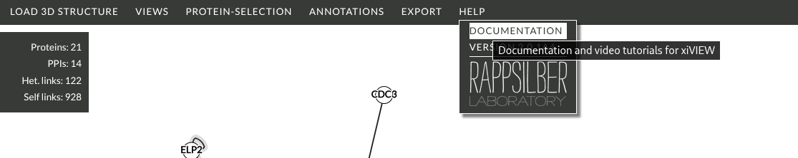

# xiVIEW Videos #

## Load AlphaFold model

The following video demonstrates opening an AlphaFold structure for the selected protein: 

<video controls width="100%">
  <source src="../vid/load-alphafold.webm" type="video/webm">
</video>

## Load 3D Model Using PDB Accession

The following video demonstrates opening a 3D model using its four character PDB accession:  

<video controls width="100%">
  <source src="../vid/load-3d-accession.webm" type="video/webm">
</video>

!!! warning
xiVIEW uses the NGL Viewer which does not support all .cif files. Specifically, it does not support models without atomic resolution, i.e. the coarse grained models used in CIF-IHM. These models can be viewed using the [MolStar viewer at RCSB](#viewing-crosslinks-using-molstar-at-rscb).

## Opening a Spectrum

The table of selected matches acts as the bridge to the spectra that support a crosslink. Selecting a match in this table will open the spectrum.

- click a link in the [network view](./views/xinet.html)
- see the list of supporting matches in the [table of selected matches](./views/selection-table.html)
- many matches can support one crosslink, a match can also support more than one crosslink if there is ambiguity about the peptide position (protein inference problem) 
- click a match in the table
- the [annotated spectrum](./views/xispec.html) should appear

<video controls width="100%">
  <source src="../vid/open-spectrum.webm" type="video/webm">
</video>

## Viewing Crosslinks using MolStar at RSCB 

Not part of xiVIEW, but as xiVIEW does not support the coarse grained CIF-IHM models we have provided a demonstration of how to view crosslinks on these models at RCSB:

<video controls width="100%">
  <source src="../vid/molstar-crosslinks-9a8w.mp4" type="video/mp4">
</video>

## More Videos

More video tutorials are available [here](https://www.rappsilberlab.org/software/xiview/).

## Text Documentation

More detailed documentation for xiVIEW is available [here](./xiview.html) and via the HELP menu of the xiVIEW network page:

