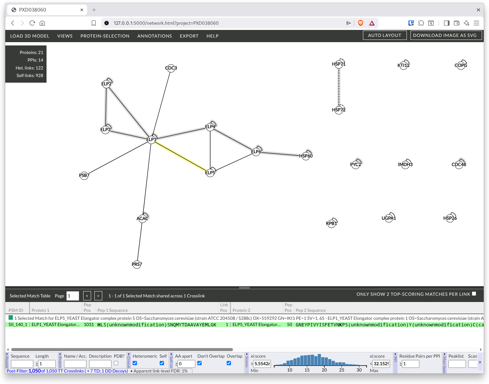
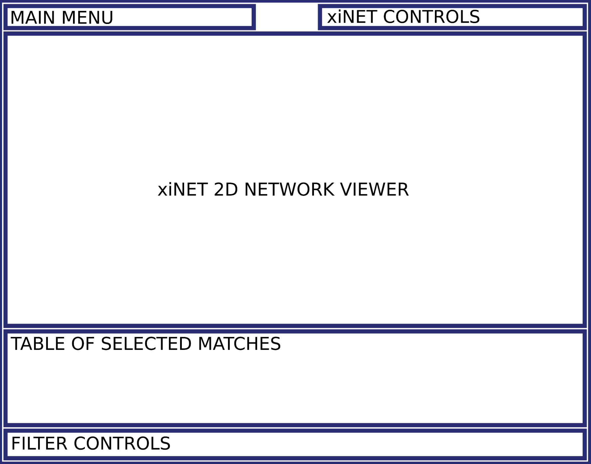

# xiVIEW Help

xiVIEW allows you to visualise crosslinking Mass Spectrometry data. It incorporates [xiSPEC](https://academic.oup.com/nar/article/46/W1/W473/4993787) for visualising spectra and [xiNET](http://www.mcponline.org/content/14/4/1137.long) for visualising the crosslink network. 

The are also demonstration [videos](./tutorials.html).

[Here is an example page.](https://www.ebi.ac.uk/pride/archive/xiview/network.html?project=PXD038060)

 *In this screenshot ELP4 has been expanded to show residue resolution by right-clicking the protein and selecting Expand Protein*

The interface shown above is organised into the following panels:

  
  <ul>
    <li>Main menu - contains dropdown menus for:
      <ul>
        <li><a href="./load-3d-model.html">Load 3D Model</a></li>
        <li><a href="./menu/views-menu.html">Views</a></li>
        <li><a href="./menu/protein-selection-menu.html">Protein Selection</a></li>
        <li><a href="./menu/annotations.html">Annotations</a></li>
        <li><a href="./menu/export-menu.html">Export</a></li>
        <li>Help (how you got here)</li>
      </ul>
    </li>
    <li>xiNET controls - buttons to:
      <ul>
        <li>automatically layout 2D network</li>
        <li>download 2D network image</li>
      </ul>
    </li>
    <li><a href="./views/xinet.html">xiNET network viewer</a></li>
    <li><a href="./views/selection-table.html">Table of selected matches</a></li>
    <li><a href="./views/filter-bar.html">Filter controls</a></li>
  </ul>

## Opening spectra
The [Selected Match Table](./views/selectionTable.html "Selected Match Table") acts as the bridge to the underlying raw data displayed in the [Spectrum View](./xispec.html) - open the xiSpec Feature Support section in this link for spectrum viewer use instructions. Selecting a match in this table will displaying the underlying raw data in the Spectrum View.

Viewing Spectra
Open a spectrum:
Click a link in the network view.
See the list of supporting matches in the table of selected matches, you may need to drag upwards the bar that divides the table from the network.
Many matches can support one crosslink, a match can also support more than one crosslink if there is ambiguity about the peptide position (protein inference problem). 
Click a match in the table.
The annotated spectrum should appear.
Video Tuorial

<video controls width="100%">
  <source src="../vid/open-spectrum.webm" type="video/webm">
</video>

> Combe, C. W., Graham, M., Kolbowski, L., Fischer, L., & Rappsilber, J. (2024). xiVIEW: Visualisation of Crosslinking Mass Spectrometry Data. Journal of Molecular Biology, 436(17), 168656. <https://doi.org/10.1016/j.jmb.2024.168656>
